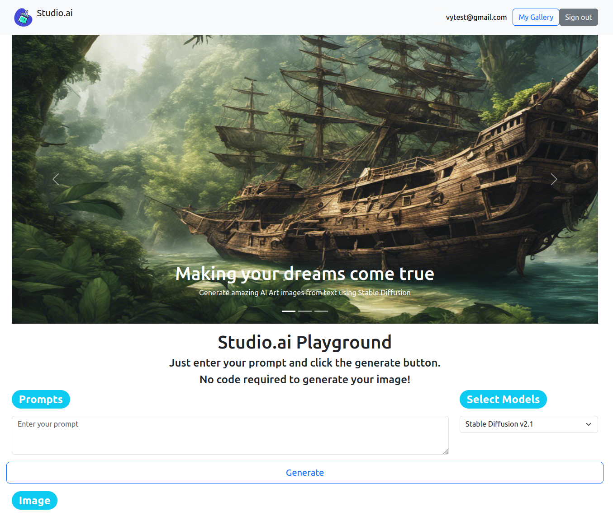
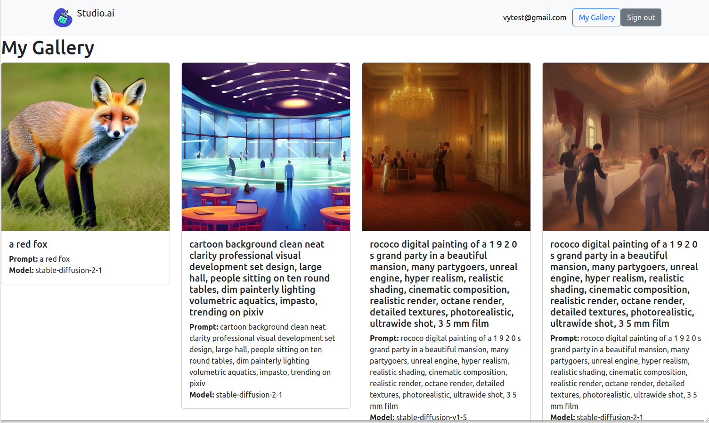

# Studio.ai  [](https://studio-ai-uqw8.onrender.com/)


[Studio.ai](https://studio-ai-uqw8.onrender.com/) is a friendly stable diffusion space for beginners. You can experiment different Generative AI models by inputting text prompts to generate high-resolution images. Registered users can:
* Input text prompt to generate images
* Choose different models to use (e.g. [stabilityai/stable-diffusion-2-1](https://huggingface.co/stabilityai/stable-diffusion-2-1?text=a+blue+bird), [runwayml/stable-diffusion-v1-5](https://huggingface.co/runwayml/stable-diffusion-v1-5))
* Once the image is generated, the user can download the image 
* Save it on your Gallery on Studio.ai's storage
* Use images for commercial or personal use.

Access Studio.ai [here](https://studio-ai-uqw8.onrender.com/)




## Table Of Content

- [Support Browsers](#support-browsers)
- [Teck Stack](#tech-stack)
- [Development](#development)
- [Deployment](#deployment)
    - [Render](#render)
- [License](#license)
- [Support Links](#support-links)

## Support Browsers
* Firefox
* Chrome
* Edge
* Opera

**Note**: Brave is not currently supported. I'm working on the issue at the moment! :computer: :coffee:

## Tech Stack
* React
* Flask
* Bootstrap and React Bootstrap
* PostgreSQL
* Redis
* Azure Blob Storage

## Development
If you want to develop or modify the code locally. Follow the following instructions. If you want to contribute to this project. Please refer to the [support links](#support-links) section.

<details open>
<summary>
Pre-requisites
</summary> <br />
First, make sure that you have the following prerequisites installed:

###
- Node.js (Recommend install NodeJS with [nvm](https://github.com/nvm-sh/nvm) to prevent future version conflict)
- [React](https://react.dev/)
- [Git](https://git-scm.com/downloads)
- [Flask](https://flask.palletsprojects.com/en/3.0.x/installation/#install-flask)(Create a virtual environment)
- Python 3.10
- [Redis](https://redis.io/docs/install/install-redis/) (If you plan to develop on Windows, read the [Redis doc on installation on Windows](https://redis.io/docs/install/install-redis/install-redis-on-windows/))
- [PostgreSQL](https://www.postgresql.org/)
</details>

<details open>
<summary>
Setting up Clientside
</summary> <br />

1. Fork or clone the repository and install dependencies for server side
```bash
git clone https://github.com/Vykp00/stable-diffusion-studio.git
```
2. Now navigate to the `client` folder and set up its dependencies by running the `package.json` file
```bash
npm install
```
After it's successfully installed, create a `.env.local` file and add the following text:
```
REACT_APP_PROXY_DOMAIN=http://127.0.0.1:5000
```
This will help React client side to communicate with the Flask server side

3. Now you can test the front end application by running. If it's running, you can move on to setting up the server
```bash
npm start
```
</details>

<details open>
<summary>
Setting up Server side
</summary> <br />
1. Next, install all dependencies for your server side. Remember to activate your [virtual environment](https://docs.python.org/3.10/library/venv.html)


```bash
pip install -r requirements. txt
```

2. If everything is ok, now we need to configure your server to communicate with your database PostgreSQL, Redis, Microsoft Azure Storage and HuggingFace (for calling model API). First, create a Postgres database, here you should get your `URI` for `SQLAlchemy` to connect to your database: 
`postgresql://<USERNAME>:<PASSWORD>@localhost/<DATABASE_NAME>`. For Redis, it should be the address when you run `redis-cli` (by default, it will be `127.0.0.1:6379`)

3. Then, [create your Azure Blob Storage](https://learn.microsoft.com/en-us/azure/storage/blobs/storage-quickstart-blobs-portal). Now you need to set credentials to [connect to your blob storage](https://learn.microsoft.com/en-us/azure/storage/blobs/storage-quickstart-blobs-python?tabs=connection-string%2Croles-azure-portal%2Csign-in-visual-studio-code). You can either use Passwordless or Connection Strings (I'm using Connection Strings since you won't need to install Azure CLI)

4. Now all it left is your `TOKEN KEY` from your Hugging Face account. If you do not submit your API token when sending requests to the API, you will not be able to run inference on your private models. You can get your API token from [your profile settings](https://huggingface.co/docs/api-inference/quicktour#get-your-api-token)

5. Now all you need to 
`.env` file on your server folder. This file will store all your secret keys, API tokens that will be used to configure your server. You should not share this file to public so make sure the file is listed in your `.gitignore` 
```
SDAPI_TOKEN="YOUR-HUGGINGFACE-API-TOKEN"
SECRET_KEY="YOUR-SECRET-KEY" # your secret password for the application
SQLALCHEMY_DATABASE_URI="postgresql://<USERNAME>:<PASSWORD>@localhost/<DATABASE_NAME>"
SESSION_REDIS="redis://[YOUR-REDIS-URL]"
AZURE_STORAGE_CONNECTION_STRING="YOUR-AZURE-CONNECTION-STRING"
```
6. Now you're all set. Run the server side by running this from `server` directory:
```bash
flask run
```
OR from the `client` directory
```bash
cd .. && npm run start-server
```
</details>

Now, you're free to test out different models of Stable Diffusion privately

## Deployment
Before deployment your application, you need to build your static folder on the client side:
```bash
npm run build
```
There are many options to host your React Flask App such as [Render](https://render.com/), [Vercel](https://vercel.com/), [Railway](https://railway.app/). I'm using Render since you can deploy all parts in one place.

### Render
1. Create PostgreSQL and Redis database on Render.
2. Deploy Flask Server Side as web service. Follow [this](https://render.com/docs/deploy-flask) instructions and make sure your set **Root Directory** as your `server` folder in the setting. You also need to specify your Python version `PYTHON_VERSION`, and other variables that were stored on your `.env` file. This time replace your local PostgreSQL and Redis url with Internal Render urls.

**Important Notes: **
* Your environment variable values should be plain text without string syntax `" "` like in your `.env` file.
* Edit PostgreSQL Render url to `postgresql://...` instead of `postgres://...` otherwise SQLAlchemy cannot connect to PostgreSQl. See details [issue](https://github.com/sqlalchemy/sqlalchemy/issues/6083)


3. Once your Server web service is live, you can now move on [deploying your React Static Site](https://render.com/docs/deploy-create-react-app) and make sure your set **Root Directory** as your `client` folder in the setting. Similar to Flask Server, you need to specify `NODE_VERSION` and `REACT_APP_PROXY_DOMAIN` in your environmental variables but this time your proxy domain should be the domain of your Flask web service on Render.

**Important Notes: **
* Use `npm run build` instead of `yarn build` if you have issue with `yarn.lock` file error.

## License

The Studio.ai web application is licensed under the terms of the [MIT License](./LICENSE)
license and is available for free.

## Support Links

* [Web site](https://studio-ai-uqw8.onrender.com/)
* [Issue tracker](https://github.com/Vykp00/stable-diffusion-studio/issues)
* [Source code](https://github.com/Vykp00/stable-diffusion-studio)
* [Author's sites](https://vykauppinen.netlify.app/index.html)
